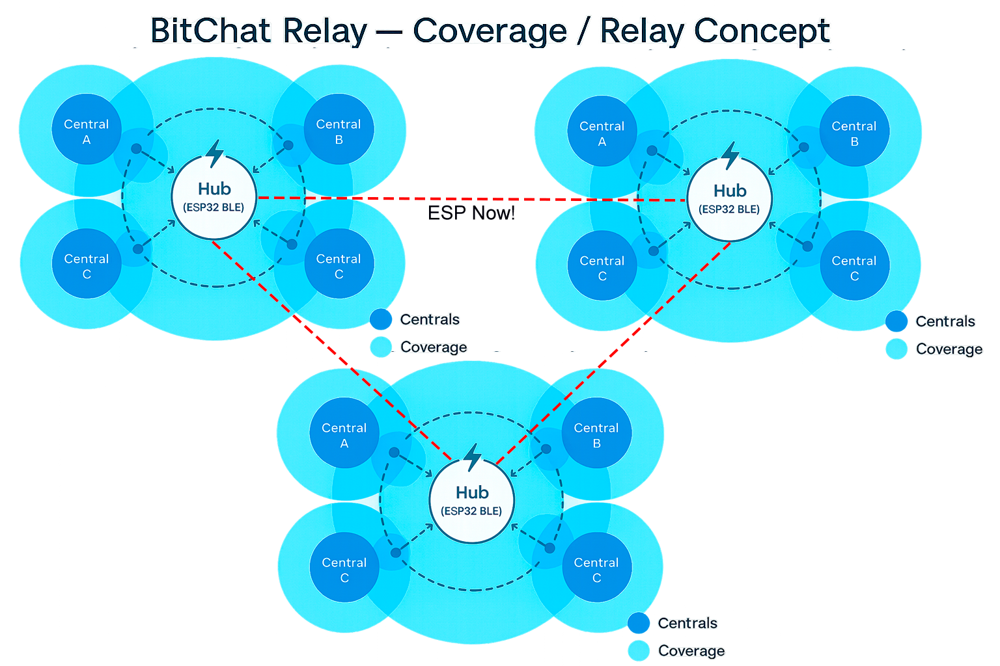

# BitChat Relay (ESP32 • BLE GATT Server)

Ultra-lightweight **BLE peripheral-only hub** that relays BitChat packets between multiple connected **centrals** (phones/tablets).  
It never acts as a BLE client or scanner. Focus: *low latency, predictable memory, loop/dup resilience, and simple deployment.*

> Codebase: single-file Arduino sketch using **NimBLE-Arduino ≥ 2.3.6**.
> Purpose: Extend coverage between other bitchat devices that are out of range of each other but are in range of the ESP (extends coverage area).

<p align="center">
  
</p>


---

## ✨ Features (what it actually does)

- **Peripheral-only, keeps advertising while connected** (multi-central)
- **Notify-only TX** (no Indicate path)
- **Fan-out per connection** with **no echo** to the sender
- **TTL enforcement**  
  - Drop if `TTL == 0` on arrival  
  - Decrement once; **drop** if it becomes `0` after `--`
- **De-duplication (FNV-1a 64-bit)** on header (+ first payload bytes) with TTL *zeroed* for hashing
- **Fragmentation + reassembly**  
  - Reassembly on inbound `FRAGMENT_TYPE` (bounded)  
  - Outbound **per-peer** fragmentation based on that peer’s MTU
- **Dynamic CAP** = `min(peer MTUs) − 3`, clamped to **≥ 20** (ATT23 → 20B payload)
- **Bounded reassembly RAM**  
  - Global: `MAX_INFLIGHT_FRAGS=10`, `MAX_INFLIGHT_BYTES=65536`  
  - **Per-sender quotas:** `≤ 4` assemblies and `≤ 16 KiB`
  - **LRU eviction** (oldest by timestamp) + **30s** fragment lifetime GC
- **Non-blocking TX queue** with **token bucket** (≈ 150 notifies/s)
  - Queue size **128**; when full, **drop oldest** and keep flowing
  - Light **per-fragment jitter** (4–10 ms) to avoid lock-step
- **Subscription-aware TX** (only notifies subscribed centrals)
- **Periodic ANNOUNCE** every **30 s + jitter (0.5–4.5 s)**
- **LED feedback** (optional) — RX: single blink; TX: double blink
- **Structured logs** for packets and 10-second status snapshots

---

## ⚙️ BLE details

- **Service UUID (placeholder):** `F47B5E2D-4A9E-4C5A-9B3F-8E1D2C3A4B5C`  
- **Characteristic UUID (placeholder):** `A1B2C3D4-E5F6-4A5B-8C9D-0E1F2A3B4C5D`
- **Characteristic props:** `READ | WRITE | WRITE_NR | NOTIFY`
- **Requested MTU:** `517` (capable payload ≈ `517−3 = 514` bytes)
- **Advertising interval:** **50–100 ms** (`setPreferredParams(0x50, 0xA0)`)
- **TX path:** `notify(connHandle)` per subscribed peer (no global broadcast API)

> **Note:** Indications are not used. If a central requires Indicate, add that path explicitly.

---

## 🔀 Packet handling

### De-dup
- Hash: **FNV-1a 64-bit** over:
  - First **19B** header with **TTL forced to 0**  
  - Plus up to **32B** of payload
- Window: **deque + set**, up to 1024 entries, evicted after **60 s**
- If seen → **drop** (prevents echo storms)

### TTL
- If `TTL == 0` **before** relay → drop (`[DROP] ttl=0 before relay`)
- Else decrement → if becomes `0` → drop (`[DROP] ttl expired after --`)

### Fragmentation (outbound)
- For each subscribed peer:
  - Compute **capPeer = MTU(peer) − 3**
  - If `len ≤ capPeer` → send direct
  - Else if `capPeer < 32` → cannot fit fragment overhead → drop for that peer
  - Else split into `FRAGMENT_TYPE` frames with header:
    ```
    base 19B header
    + 8B fragID (random)
    + 2B index
    + 2B total
    + 1B originalType
    + chunk
    ```
  - Small **per-fragment jitter** (4…10 ms) between notifies

### Reassembly (inbound `FRAGMENT_TYPE`)
- Key: **(senderID, fragID)**
- Store by index; complete when all indices are present
- Hard ceiling: payload **≤ 4 KiB** (drop if over)
- **Per-sender quotas** enforced before creating an assembly
- **GC:** lifetime **30 s**; evicts oldest with proper counter accounting

---

## 📊 Status log (every ~10 s)
A typical line:

[STAT] pktsIn=… bytesIn=… pktsOut=… bytesOut=… writes=… notifies=… heap=…
minCap=… q=… tokens=… dedupWin=… drops{dedup=…,backp=…}
inflightB=… t1_in=… t2_in=… peers=… subs{notify=…} MTUs: ch=H:mtu=M …
- **minCap**: current global CAP (`min(MTU)−3`)
- **q / tokens**: TX queue size / available notify tokens
- **drops**: dedup / backpressure counters
- **inflightB**: bytes buffered in reassembly
- **t1_in / t2_in**: counters per type (as observed)
- **peers / subs**: connected centrals / subscribed centrals
- **MTUs**: per-connection MTU list

---

## 🧪 Quick start

1. **Flash** the sketch to ESP32 (Arduino core).  
2. Device name: `BitChatRelay_<MAC_SUFFIX>` (auto).  
3. Connect with one or more centrals and **subscribe** (CCCD).  
4. **WRITE / WRITE_NR** BitChat frames to the characteristic.  
5. Watch relaying and `[STAT]` in Serial (115200 baud).

---

## 🔧 Configuration knobs (in code)

- `REQUESTED_MTU` (default `517`)
- Advertising: `adv->setPreferredParams(0x50, 0xA0)` (50–100 ms)
- **Dedup:** `DEDUP_MAX`, `DEDUP_TTL_MS`
- **Reassembly:** `FRAG_LIFETIME_MS`, `MAX_INFLIGHT_FRAGS`, `MAX_INFLIGHT_BYTES`
- **Per-sender quotas:** `MAX_FRAGS_PER_SENDER`, `MAX_INFLIGHT_BYTES_PER_SENDER`
- **TX queue / rate:** `MAX_TX_QUEUE` (128), `gNotifyBudgetPerSec` (≈150/s)
- LED timings: `LED_RX_ON_MS`, `LED_TX_ON_MS`, `LED_TX_GAP_MS`
- Debug level: `debugLevel` (1..4)

---

## 🛠 Build / Environment

- **ESP32 Arduino Core** (tested with `esp32:esp32 2.0.x`)
- **NimBLE-Arduino ≥ 2.3.6**
- Serial: **115200**
- Optional: define `LED_PIN` (default `2`)

---

## 🧭 Design notes & limits

- Pure **peripheral** (no scan/client).  
- **No Indicate** path implemented (Notify only).  
- Reassembly **RAM-bounded**; large payloads **> 4 KiB** are dropped on reassembly.  
- If a peer is stuck at **MTU 23** (cap=20), outbound fragmentation to that peer is **not possible** (`capPeer < 32`).  
- No built-in crypto; BitChat payload is treated opaque.

---

## 🔍 Troubleshooting

- **Nothing received by phone**  
  Ensure the app **subscribed** to notifications (CCCD). Check `subs{notify=?}` in stats.

- **Queue/backpressure increasing**  
  Raise `MAX_TX_QUEUE` moderately or reduce sending rate (lower `gNotifyBudgetPerSec`), or increase per-fragment jitter.

- **Unexpected fragmentation**  
  Check `minCap` and per-peer MTUs in stats. If `minCap = 20`, your central didn’t negotiate MTU.

---

## 📄 License

MIT License © 2024 Ricardo and contributors
# BitChat Relay (ESP32 • BLE GATT Server)

Ultra-lightweight **BLE peripheral-only hub** that relays BitChat packets between multiple connected **centrals** (phones/tablets).  
It never acts as a BLE client or scanner. Focus: *low latency, predictable memory, loop/dup resilience, and simple deployment.*

> Codebase: single-file Arduino sketch using **NimBLE-Arduino ≥ 2.3.6**.
> Purpose: Extend coverage between other bitchat devices that are out of range of each other but are in range of the ESP (extends coverage area).

---

## ✨ Features (what it actually does)

- **Peripheral-only, keeps advertising while connected** (multi-central)
- **Notify-only TX** (no Indicate path)
- **Fan-out per connection** with **no echo** to the sender
- **TTL enforcement**  
  - Drop if `TTL == 0` on arrival  
  - Decrement once; **drop** if it becomes `0` after `--`
- **De-duplication (FNV-1a 64-bit)** on header (+ first payload bytes) with TTL *zeroed* for hashing
- **Fragmentation + reassembly**  
  - Reassembly on inbound `FRAGMENT_TYPE` (bounded)  
  - Outbound **per-peer** fragmentation based on that peer’s MTU
- **Dynamic CAP** = `min(peer MTUs) − 3`, clamped to **≥ 20** (ATT23 → 20B payload)
- **Bounded reassembly RAM**  
  - Global: `MAX_INFLIGHT_FRAGS=10`, `MAX_INFLIGHT_BYTES=65536`  
  - **Per-sender quotas:** `≤ 4` assemblies and `≤ 16 KiB`
  - **LRU eviction** (oldest by timestamp) + **30s** fragment lifetime GC
- **Non-blocking TX queue** with **token bucket** (≈ 150 notifies/s)
  - Queue size **128**; when full, **drop oldest** and keep flowing
  - Light **per-fragment jitter** (4–10 ms) to avoid lock-step
- **Subscription-aware TX** (only notifies subscribed centrals)
- **Periodic ANNOUNCE** every **30 s + jitter (0.5–4.5 s)**
- **LED feedback** (optional) — RX: single blink; TX: double blink
- **Structured logs** for packets and 10-second status snapshots

---

## ⚙️ BLE details

- **Service UUID (placeholder):** `F47B5E2D-4A9E-4C5A-9B3F-8E1D2C3A4B5C`  
- **Characteristic UUID (placeholder):** `A1B2C3D4-E5F6-4A5B-8C9D-0E1F2A3B4C5D`
- **Characteristic props:** `READ | WRITE | WRITE_NR | NOTIFY`
- **Requested MTU:** `517` (capable payload ≈ `517−3 = 514` bytes)
- **Advertising interval:** **50–100 ms** (`setPreferredParams(0x50, 0xA0)`)
- **TX path:** `notify(connHandle)` per subscribed peer (no global broadcast API)

> **Note:** Indications are not used. If a central requires Indicate, add that path explicitly.

---

## 🔀 Packet handling

### De-dup
- Hash: **FNV-1a 64-bit** over:
  - First **19B** header with **TTL forced to 0**  
  - Plus up to **32B** of payload
- Window: **deque + set**, up to 1024 entries, evicted after **60 s**
- If seen → **drop** (prevents echo storms)

### TTL
- If `TTL == 0` **before** relay → drop (`[DROP] ttl=0 before relay`)
- Else decrement → if becomes `0` → drop (`[DROP] ttl expired after --`)

### Fragmentation (outbound)
- For each subscribed peer:
  - Compute **capPeer = MTU(peer) − 3**
  - If `len ≤ capPeer` → send direct
  - Else if `capPeer < 32` → cannot fit fragment overhead → drop for that peer
  - Else split into `FRAGMENT_TYPE` frames with header:
    ```
    base 19B header
    + 8B fragID (random)
    + 2B index
    + 2B total
    + 1B originalType
    + chunk
    ```
  - Small **per-fragment jitter** (4…10 ms) between notifies

### Reassembly (inbound `FRAGMENT_TYPE`)
- Key: **(senderID, fragID)**
- Store by index; complete when all indices are present
- Hard ceiling: payload **≤ 4 KiB** (drop if over)
- **Per-sender quotas** enforced before creating an assembly
- **GC:** lifetime **30 s**; evicts oldest with proper counter accounting

---

## 📊 Status log (every ~10 s)
A typical line:

[STAT] pktsIn=… bytesIn=… pktsOut=… bytesOut=… writes=… notifies=… heap=…
minCap=… q=… tokens=… dedupWin=… drops{dedup=…,backp=…}
inflightB=… t1_in=… t2_in=… peers=… subs{notify=…} MTUs: ch=H:mtu=M …
- **minCap**: current global CAP (`min(MTU)−3`)
- **q / tokens**: TX queue size / available notify tokens
- **drops**: dedup / backpressure counters
- **inflightB**: bytes buffered in reassembly
- **t1_in / t2_in**: counters per type (as observed)
- **peers / subs**: connected centrals / subscribed centrals
- **MTUs**: per-connection MTU list

---

## 🧪 Quick start

1. **Flash** the sketch to ESP32 (Arduino core).  
2. Device name: `BitChatRelay_<MAC_SUFFIX>` (auto).  
3. Connect with one or more centrals and **subscribe** (CCCD).  
4. **WRITE / WRITE_NR** BitChat frames to the characteristic.  
5. Watch relaying and `[STAT]` in Serial (115200 baud).

---

## 🔧 Configuration knobs (in code)

- `REQUESTED_MTU` (default `517`)
- Advertising: `adv->setPreferredParams(0x50, 0xA0)` (50–100 ms)
- **Dedup:** `DEDUP_MAX`, `DEDUP_TTL_MS`
- **Reassembly:** `FRAG_LIFETIME_MS`, `MAX_INFLIGHT_FRAGS`, `MAX_INFLIGHT_BYTES`
- **Per-sender quotas:** `MAX_FRAGS_PER_SENDER`, `MAX_INFLIGHT_BYTES_PER_SENDER`
- **TX queue / rate:** `MAX_TX_QUEUE` (128), `gNotifyBudgetPerSec` (≈150/s)
- LED timings: `LED_RX_ON_MS`, `LED_TX_ON_MS`, `LED_TX_GAP_MS`
- Debug level: `debugLevel` (1..4)

---

## 🛠 Build / Environment

- **ESP32 Arduino Core** (tested with `esp32:esp32 2.0.x`)
- **NimBLE-Arduino ≥ 2.3.6**
- Serial: **115200**
- Optional: define `LED_PIN` (default `2`)

---

## 🧭 Design notes & limits

- Pure **peripheral** (no scan/client).  
- **No Indicate** path implemented (Notify only).  
- Reassembly **RAM-bounded**; large payloads **> 4 KiB** are dropped on reassembly.  
- If a peer is stuck at **MTU 23** (cap=20), outbound fragmentation to that peer is **not possible** (`capPeer < 32`).  
- No built-in crypto; BitChat payload is treated opaque.

---

## 🔍 Troubleshooting

- **Nothing received by phone**  
  Ensure the app **subscribed** to notifications (CCCD). Check `subs{notify=?}` in stats.

- **Queue/backpressure increasing**  
  Raise `MAX_TX_QUEUE` moderately or reduce sending rate (lower `gNotifyBudgetPerSec`), or increase per-fragment jitter.

- **Unexpected fragmentation**  
  Check `minCap` and per-peer MTUs in stats. If `minCap = 20`, your central didn’t negotiate MTU.

---

## 📄 License

MIT License © 2024 Ricardo and contributors
